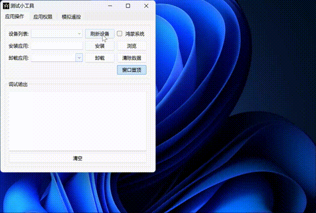
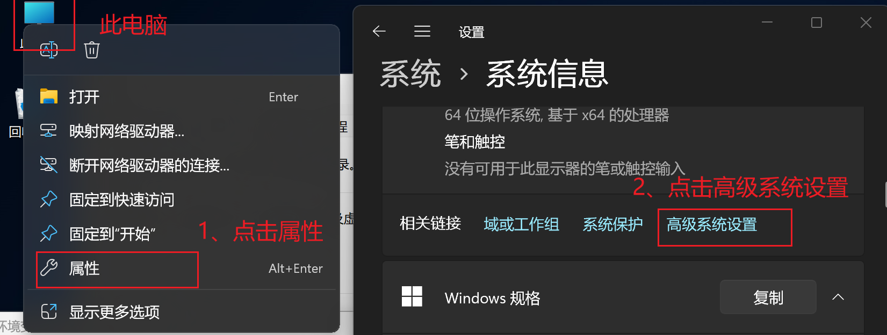
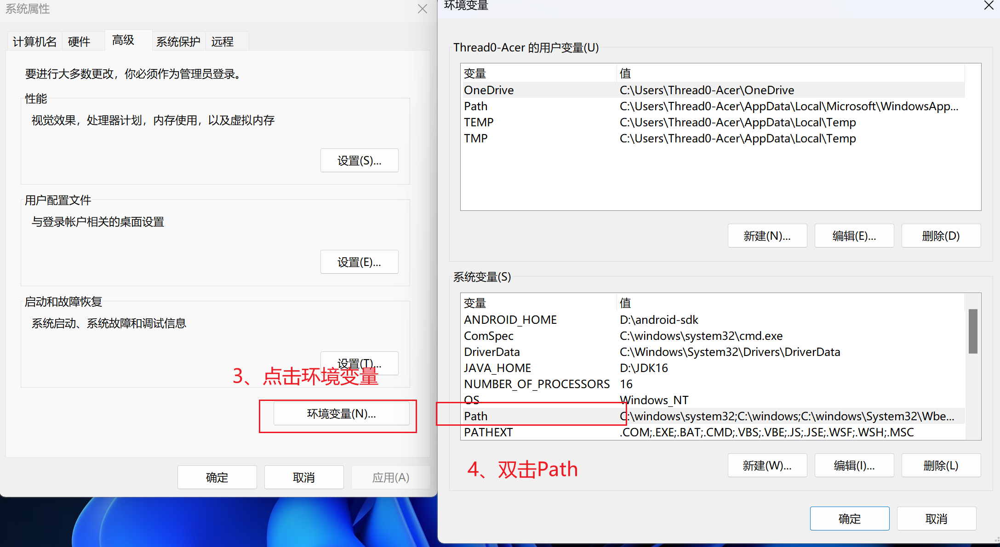
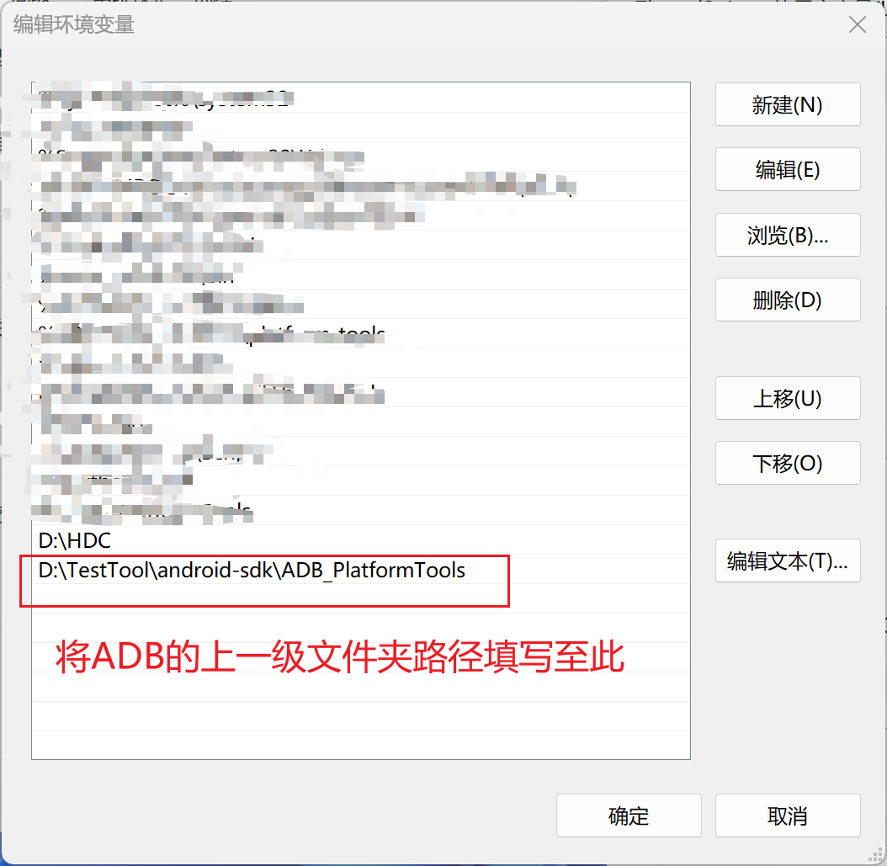
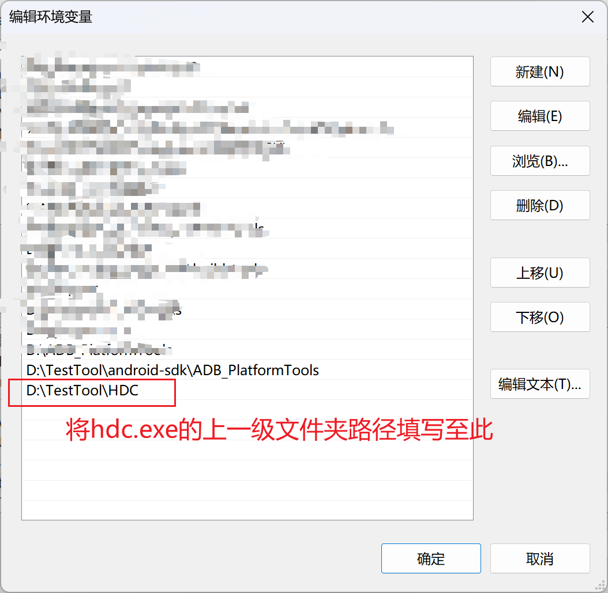

# TestTool

#### 介绍

TestTool是基于ADB、HDC命令的图形化界面工具，兼容.apk/.apks/.hap格式的安装包, 方便测试人员进行安装、卸载应用,此外还支持权限对比功能,在App版本迭代时,能够检查新包对比旧包是否增加了新的权限声明.

#### 安装与配置

此工具需要依赖ADB以及HDC，所以需要在系统的环境变量中配置。如果已经配置，可忽略以下步骤，直接点击TestTool.exe，运行程序，直接使用.
1. 配置ADB运行环境:
（1）进入【系统变量】下的【Path】

（2）adb.exe在TestTool->android-sdk->ADB_PlatformTools目录下，复制adb.exe上一级的文件夹路径，将路径填写在Path中。在此不急着关闭打开的窗口继续配置HDC运行环境。

2. 配置HDC运行环境:
在上一个步骤的基础上，继续复制hdc.exe上一级的文件夹路径，并同样填写在Path中。之后逐个点击弹窗中的【确定】关闭弹窗.

#### 使用说明

【刷新设备】：显示当前与电脑的所有连接设备。如果是HarmonyOS NEXT版本的手机，需要勾选鸿蒙系统，方能显示。只有选择设备才能进行后续的【安装】、【卸载】、【清除数据】操作。

【安装】：安装应用程序。将电脑上的安装包拖动至此小工具窗口；或者选择点击【浏览】，从系统文件夹中选择安装包；点击【安装】将安装包安装至手机。

【卸载】：输入包名，或者从下拉列表中选择应用，卸载与当前电脑连接的手机中的应用。

【清除数据】：输入包名，或者从下拉列表中选择，清除指定包名的应用数据，使应用变为初始安装状态。

【权限对比】：对比两个安装包中声明的权限。主要用来比较新旧版本，在新版本中是否增加了新的权限声明。目前只支持apk包，apk安装包路径中不能包含中文字符。如果有，请重命名包含中文的文件夹名。

当鼠标焦点在窗口中时，鼠标悬浮按钮在上，也有相对应的提示。另外,请不要删除install_apks.jar以及aapt.exe,install_apks.jar是用来安装apks安装包的依赖,权限对比依赖aapt.exe.

