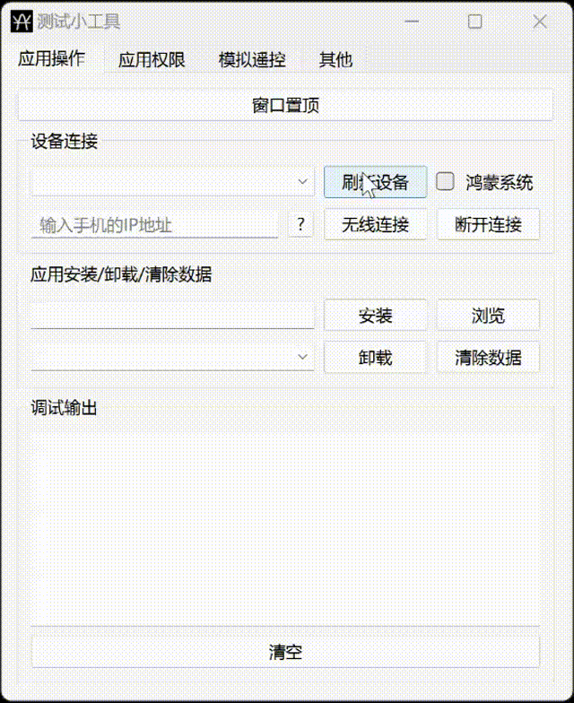

# TestTool

### 介绍
TestTool是基于ADB、HDC命令的图形化界面工具，兼容.apk/.apks/.hap格式的安装包, 方便测试人员进行安装、卸载应用,此外还支持查看应用声明权限、截图、录屏、以及抓取日志进行日志分析等功能.

### 安装与配置
此工具需要依赖ADB以及HDC，所以需要在系统的环境变量中配置。如果已经配置，可忽略以下步骤，直接点击TestTool.exe，运行程序，直接使用.
1. 配置ADB运行环境:

（1）进入【系统变量】下的【Path】

（2）adb.exe在TestTool->android-sdk->ADB_PlatformTools目录下，复制adb.exe上一级的文件夹路径，将路径填写在Path中。在此不急着关闭打开的窗口继续配置HDC运行环境。

2. 配置HDC运行环境:
在上一个步骤的基础上，继续复制hdc.exe上一级的文件夹路径，并同样填写在Path中。之后逐个点击弹窗中的【确定】关闭弹窗.

### 功能说明
【窗口置顶】: 将此窗口固定置于其他窗口上方.

【刷新设备】：显示当前与电脑的所有连接设备。如果是HarmonyOS NEXT版本的手机，需要勾选鸿蒙系统，方能显示.只有选择设备才能进行后续的"安装"、"卸载"、"清除数据"操作.

【无线连接】: 首次需要使用USB线进行连接(如果已经处在同一网络环境下,可以点击"?"获取手机的IP地址),后续保证手机与电脑处在同一网络环境下,在输入框中输入手机的IP地址即可进行连接.

【安装】：安装应用程序。将电脑上的安装包拖动至此小工具窗口；或者选择点击"浏览"，从系统文件夹中选择安装包；点击"安装"将安装包安装至手机,支持apk、apks、hap格式的安装包.

【卸载】：输入包名，或者从下拉列表中选择应用，卸载与当前电脑连接的手机中的应用.(根据自己的需要修改预设的应用)

【清除数据】：输入包名，或者从下拉列表中选择，清除指定包名的应用数据，使应用变为初始安装状态.(根据自己的需要修改预设的应用)

【权限对比】：对比两个安装包中声明的权限。主要用来比较新旧版本，在新版本中是否增加了新的权限声明。目前只支持apk包，apk安装包路径中不能包含中文字符。如果有，请重命名包含中文的文件夹名.

【手机截图】: 进行手机截图并保存至电脑指定的文件夹下,使用前需要保证设备连接以及保存路径的选择.

【手机录屏】: 进行手机录屏操作,最长录制3分钟,3分钟后自动保存录屏文件并保存至指定的文件夹下.可点击"结束录屏"提前结束录屏.

【日志】:点击"开始"进行日志记录,点击"结束"结束日志记录并将日志文件保存到电脑指定的文件夹下,保存后的日志文件格式为:txt.可选择日志文件分析日志文件中含有的异常关键字,筛选结果将展现在表格中.

### 关于打包
项目使用的是pyinstaller打包:

    pyinstaller --name TestTool --onefile --windowed --icon=res/test_tool.ico ui/main_window.py
↑↑↑此命令会生成一个spec文件,修改↑↑↑
    
    pyinstaller TestTool.spec
↑↑↑最终打包生成exe文件↑↑↑

若是要直接使用,直接运行项目中的TestTool.exe,这是已经打包好的.关于打包具体细节在此不做过多叙述.